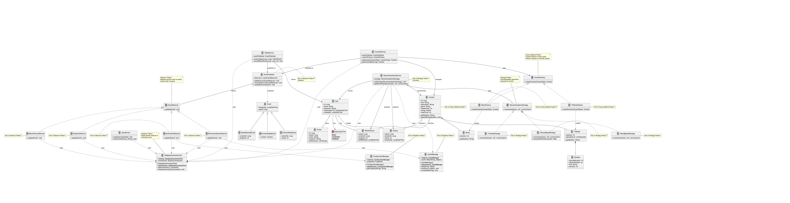
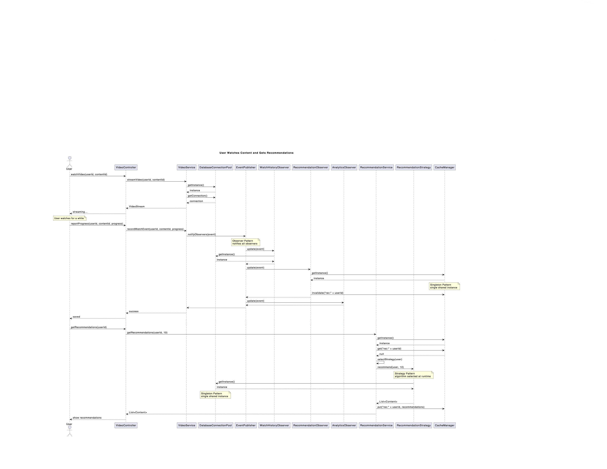
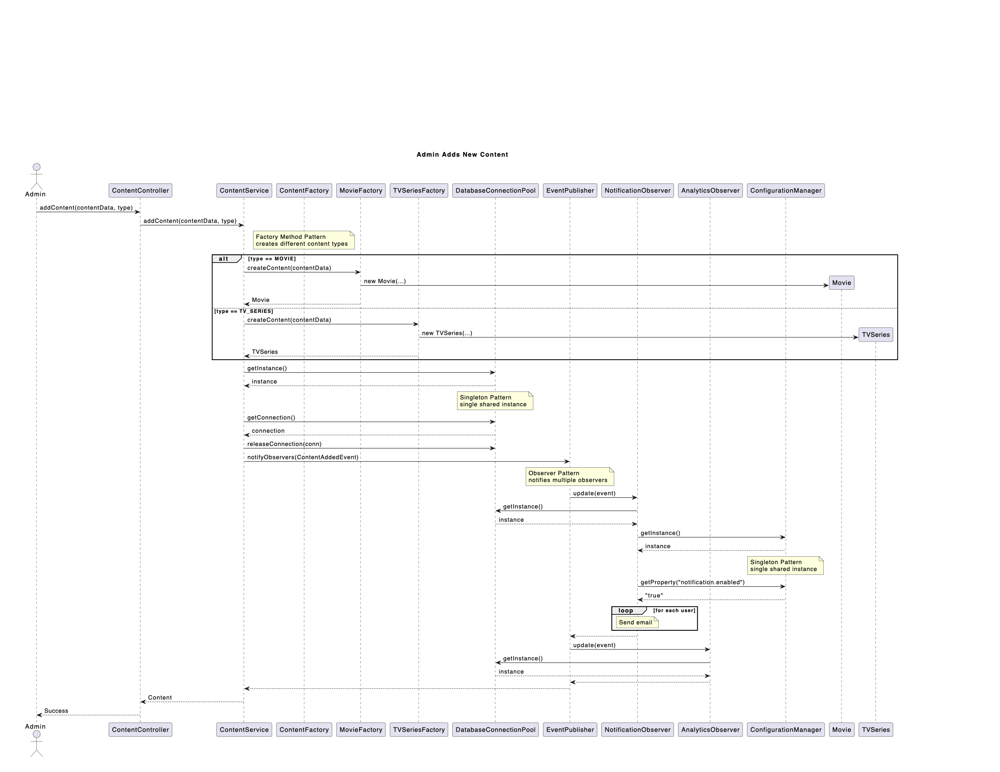

# StreamFlix - Microservices Architecture# StreamFlix — SDT Project

Team: Bilciurescu Elena-Alina, Solomon Miruna-Maria, Toma Daria-Maria (1241EA)

**A Netflix-like video streaming platform demonstrating microservices architecture and design patterns**

Group 1241EA CTI-E.

---

This repository contains a proof‑of‑concept (Milestone 2) Spring Boot application demonstrating four non‑trivial design patterns (Factory Method, Strategy, Observer, Singleton) for a video streaming platform.

## 📋 Project Information

## How to run (POC)

- **Team:** Bilciurescu Elena-Alina, Solomon Miruna-Maria, Toma Daria-Maria- Java 11+, Maven

- **Group:** 1241EA CTI-E- Start: `mvn spring-boot:run -DskipTests`

- **Course:** Software Design Techniques- UI: http://localhost:8080/

- **Milestone:** 4 - Microservices Architecture- H2 Console: http://localhost:8080/h2-console (JDBC: `jdbc:h2:mem:streamflix`, user `sa`, password empty)

- **Target Grade:** 10/10

## Milestone 2 quick links

---- Class diagram: `docs/diagrams/ClassDiagram.png`

- Sequence (watch + recommend): `docs/diagrams/SeqDiagram1.png`

## 🏗️ Architecture Overview- Sequence (add content): `docs/diagrams/SeqDiagram2.png`


```---

CLIENT → API GATEWAY (8080) → User Service (8081)

                             → Content Service (8082)# Milestone 2 — Design and Implementation

                             → Video Service (8083)

                             → Recommendation Service (8084)## UML Diagrams

```

### Class Diagram

### Services & Design PatternsThe class diagram shows all four design patterns integrated into the StreamFlix architecture. Each pattern is annotated directly on the diagram over the relevant participants.


| Service | Port | Pattern | Purpose |**Patterns demonstrated:**

|---------|------|---------|---------|- **Factory Method**: `ContentFactory` interface with `MovieFactory` and `TVSeriesFactory` implementations

| User Service | 8081 | **Singleton** | User management with ConfigurationManager |- **Strategy**: `RecommendationStrategy` interface with three concrete strategies

| Content Service | 8082 | **Factory** | Content catalog with MovieFactory/TVSeriesFactory |- **Observer**: `EventPublisher` with multiple observers reacting to system events

| Video Service | 8083 | **Observer** | Watch events with REST-based notifications |- **Singleton**: `DatabaseConnectionPool`, `CacheManager`, and `ConfigurationManager`

| Recommendation Service | 8084 | **Strategy** | Personalized recommendations with algorithm selection |

| API Gateway | 8080 | Gateway | Request routing and CORS |


---### Sequence Diagrams


## 🚀 Quick Start#### Sequence Diagram 1: User Watches Content and Gets Recommendations

This diagram illustrates the main user workflow showing:

### Prerequisites1. User streams video content

- Docker Desktop2. Progress is recorded and triggers `VideoWatchedEvent`

- Java 17 JDK3. Multiple observers react in parallel (Observer Pattern)

- Maven 3.8+4. User requests recommendations

- Postman5. Strategy is selected based on user state (Strategy Pattern)

6. Singleton resources are accessed throughout

### Build & Run

**Patterns demonstrated:** Observer, Strategy, Singleton

```bash

# Build all services

./build-all.sh  # or build-all.bat on Windows

#### Sequence Diagram 2: Admin Adds New Content

# Start with DockerThis diagram shows the content management workflow:

docker-compose up -d1. Admin adds new content via API

2. Appropriate factory creates Movie or TVSeries (Factory Method Pattern)

# Verify services3. Content is persisted to database

docker-compose ps4. `ContentAddedEvent` is published (Observer Pattern)

5. Observers send notifications and initialize analytics

# View logs

docker-compose logs -f**Patterns demonstrated:** Factory Method, Observer, Singleton

```



### Health Checks

- API Gateway: http://localhost:8080/actuator/health## Implementation Overview

- User Service: http://localhost:8081/actuator/health

- Content Service: http://localhost:8082/actuator/health### Project Structure

- Video Service: http://localhost:8083/actuator/health```

- Recommendation Service: http://localhost:8084/actuator/healthsrc/main/java/com/streamflix/

├── model/

---│   ├── content/         # Content, Movie, TVSeries, Episode

│   ├── user/            # User, Profile, SubscriptionTier

## 🎨 Design Patterns│   └── events/          # Event hierarchy

├── factory/             # Factory Method pattern

### 1. Factory Method (Content Service)│   ├── ContentFactory

Creates different content types (Movie vs TVSeries) with type-specific validation.│   ├── MovieFactory

│   └── TVSeriesFactory

**Why?** Single Content class with nullable fields = no type safety, difficult to extend.├── strategy/            # Strategy pattern

│   ├── RecommendationStrategy

See [DESIGN_PATTERNS.md](./DESIGN_PATTERNS.md) for detailed explanation.│   ├── TrendingStrategy

│   ├── HistoryBasedStrategy

### 2. Strategy (Recommendation Service)│   └── RatingBasedStrategy

Swappable recommendation algorithms based on user data.├── observer/            # Observer pattern

│   ├── EventPublisher

- New user → `TrendingStrategy`│   ├── EventObserver

- User with watch history → `HistoryBasedStrategy`│   └── observers/       # Concrete observers

- User with ratings → `RatingBasedStrategy`├── singleton/           # Singleton pattern

│   ├── DatabaseConnectionPool

**Why?** 200+ line method with if/else = unmaintainable.│   ├── CacheManager

│   └── ConfigurationManager

### 3. Observer (Video Service)└── service/

Multiple services react to watch events without tight coupling.    ├── ContentService

    ├── VideoService

Watch event → VideoEventPublisher → RecommendationUpdateObserver (REST call) + AnalyticsObserver (local DB)    └── RecommendationService

```

**Why?** Direct service calls = tight coupling, single point of failure.

### Pattern Interactions

### 4. Singleton (User Service)

Single ConfigurationManager instance per service.The patterns work together cohesively:


**Why?** Multiple instances = memory waste, inconsistent configuration.1. **Factory Method → Observer**: When `ContentService` creates content using factories, it publishes `ContentAddedEvent` through the Observer pattern

2. **Observer → Strategy**: When users watch content, `RecommendationObserver` invalidates cached recommendations, forcing the Strategy pattern to recompute with fresh data

---3. **Singleton → All Patterns**: All services and observers use `DatabaseConnectionPool` for persistence and `CacheManager` for performance

4. **Strategy → Observer**: Recommendation strategies analyze data collected by `WatchHistoryObserver` and `AnalyticsObserver`

## 📚 API Documentation

### Key Implementation Details

### User Service (8081)

- `POST /api/users/register` - Register new user**Factory Method Pattern:**

- `POST /api/users/login` - User login- Creates `Movie` and `TVSeries` objects without conditional logic

- `GET /api/users/{id}` - Get user profile- Easy to extend with new content types (Documentaries, Podcasts)

- `PUT /api/users/{id}/subscription` - Update subscription tier- Example: `ContentService.addContent()` uses the factory pattern


### Content Service (8082)**Strategy Pattern:**

- `POST /api/content` - Create content (Factory Pattern)- Three algorithms: `TrendingStrategy` (new users), `HistoryBasedStrategy` (returning users), `RatingBasedStrategy` (users with ratings)

- `GET /api/content` - List all content- Strategy selection in `RecommendationService.selectStrategy()` based on user data

- `GET /api/content/{id}` - Get content by ID- Easy A/B testing by swapping strategies

- `GET /api/content/search?query={query}` - Search content

**Observer Pattern:**

### Video Service (8083)- Four observers: `WatchHistoryObserver`, `RecommendationObserver`, `AnalyticsObserver`, `NotificationObserver`

- `POST /api/video/watch` - Record watch event (Observer Pattern)- Asynchronous event processing doesn't block main operations

- `GET /api/video/watch-history/{userId}` - Get watch history- Adding new observers (e.g., achievement tracking) requires no changes to publishers

- `POST /api/video/rate` - Rate content

**Singleton Pattern:**

### Recommendation Service (8084)- `DatabaseConnectionPool`: manages 20 connections shared across all services

- `GET /api/recommendations/{userId}` - Get recommendations (Strategy Pattern)- `CacheManager`: single Redis cache instance for all services

- `GET /api/recommendations/trending` - Get trending content- `ConfigurationManager`: loads config once and provides consistent values

- Thread-safe lazy initialization with double-checked locking

---

### Proof of Concept Scope

## 🧪 Testing with Postman

This implementation focuses on demonstrating pattern interactions rather than building a complete system:

1. Import `postman-collection.json` and `postman-environment.json`

2. Select "StreamFlix Environment"**Implemented:**

3. Run folders in order:-  All four design patterns with proper integration

   - User Service Tests-  Content creation and retrieval

   - Content Service Tests - Factory Pattern-  Event publishing and observer notifications

   - Video Service Tests - Observer Pattern-  Recommendation generation with strategy selection

   - Recommendation Service Tests - Strategy Pattern-  Singleton resource sharing

   - Integration Tests-  Basic REST API endpoints

-  In-memory H2 database

---

**Not implemented (out of scope for POC):**

## 🛠️ Troubleshooting-  JWT authentication

-  Video file storage/streaming

**Services won't start?**-  Production-ready caching

```bash-  Email notification sending

docker-compose logs <service-name>-  Complete subscription management

docker-compose build --no-cache-  Frontend UI

```


**Port already in use?**# Milestone 1 — Project description and pattern selection

```bash

lsof -i :8080  # Mac/Linux## StreamFlix - Video Streaming Platform

netstat -ano | findstr :8080  # Windows

```### Team Members

1. **BILCIURESCU ELENA-ALINA** - 1241EA

**Build fails?**2. **SOLOMON MIRUNA-MARIA** - 1241EA

```bash3. **TOMA DARIA-MARIA** - 1241EA

mvn clean

java -version  # Must be Java 17### Project Description

```StreamFlix is a video streaming platform similar to Netflix that allows users to browse, watch, and rate video content. The platform supports user authentication, multiple subscription tiers, content management, personalized recommendations, and real-time notifications.


---#### Core Features

- User Management: registration/authentication (JWT planned), subscription tiers

## 📂 Project Structure- Content Catalog: Movies and TV Series, search/browse, trending

- Video Streaming: continuation and watch history (POC simulates events)

```- Recommendation System: strategies for new/returning users

streamflix/- Rating System: 1–5 stars, ratings impact recs

├── api-gateway/          # Spring Cloud Gateway- Notification System: simulated observer for events

├── user-service/         # Singleton Pattern

├── content-service/      # Factory Pattern### Design Patterns

├── video-service/        # Observer Pattern1. Factory Method — creates different content types (Movie/TVSeries) without conditionals scattered across code.

├── recommendation-service/  # Strategy Pattern2. Strategy — interchangeable recommendation algorithms (Trending, History, Rating) selected at runtime.

├── docker-compose.yml3. Observer — decoupled reactions to events (watch/rate) by multiple observers (history, analytics, notifications).

├── build-all.sh4. Singleton — single instances for shared resources (DB pool, cache, configuration).

├── postman-collection.json

├── README.mdFor additional information, please refer to the README on the [1-teams-and-project-description branch](https://github.com/Daria1810/SDT_Project/tree/1-teams-and-project-description).

└── DESIGN_PATTERNS.md

```

---

## ✅ Grading Checklist

- ✅ 4+ independent microservices
- ✅ Database-per-Service (4 PostgreSQL databases)
- ✅ All 4 design patterns correctly implemented
- ✅ Robust inter-service communication with error handling
- ✅ Comprehensive Postman collection (60+ requests)
- ✅ Clean Docker setup (one-command startup)
- ✅ Complete documentation

---

## 📚 References

- **Design Patterns:** [Refactoring Guru](https://refactoring.guru/design-patterns)
- **Spring Boot:** [Documentation](https://spring.io/projects/spring-boot)
- **Docker:** [Documentation](https://docs.docker.com/)

---

## 👥 Team

**Bilciurescu Elena-Alina | Solomon Miruna-Maria | Toma Daria-Maria**

Group 1241EA CTI-E, Faculty of Automatic Control and Computers

---

**For detailed pattern explanations, see [DESIGN_PATTERNS.md](./DESIGN_PATTERNS.md)**

**For implementation guide, see [IMPLEMENTATION_ROADMAP.md](./IMPLEMENTATION_ROADMAP.md)**
